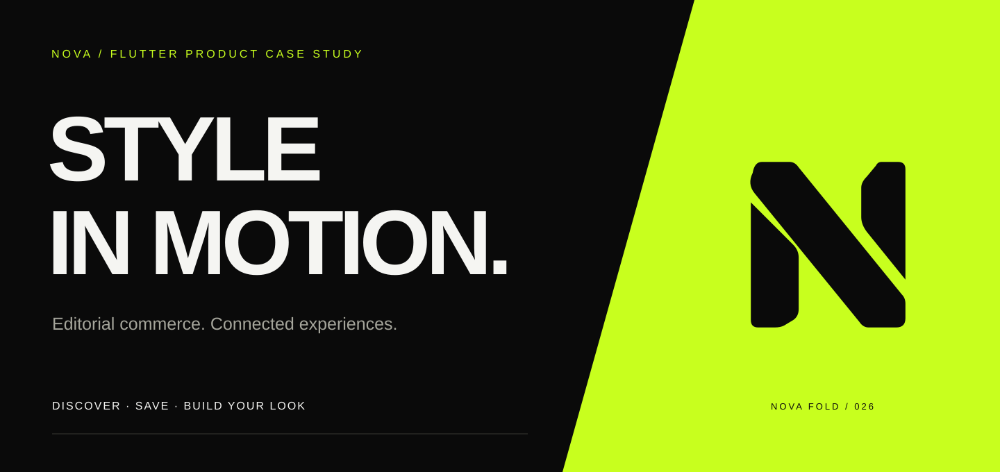
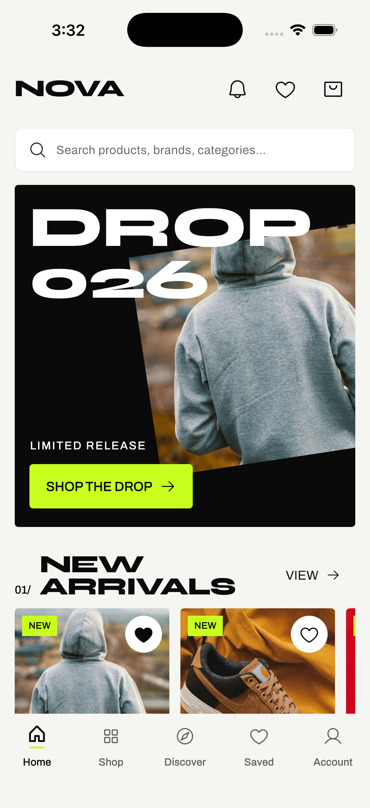
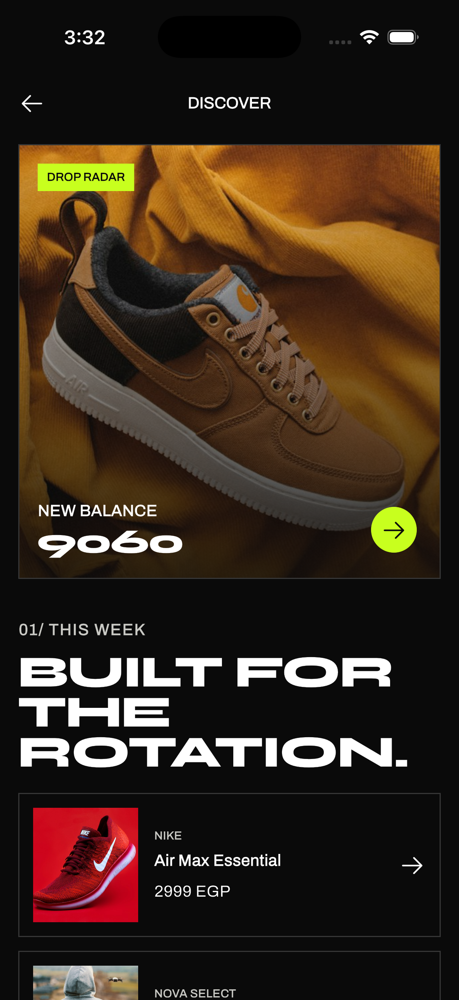
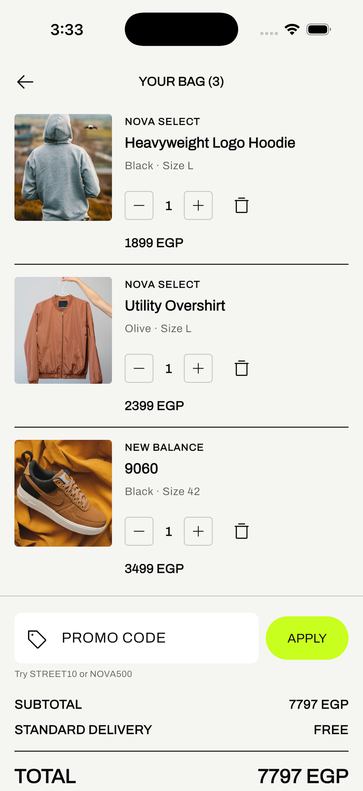
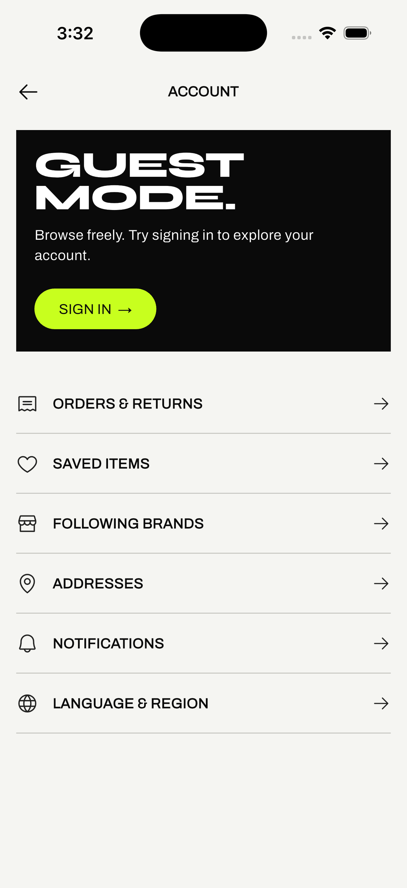
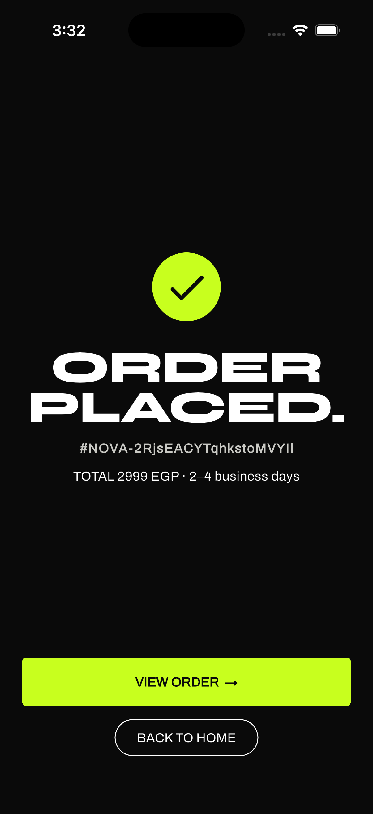
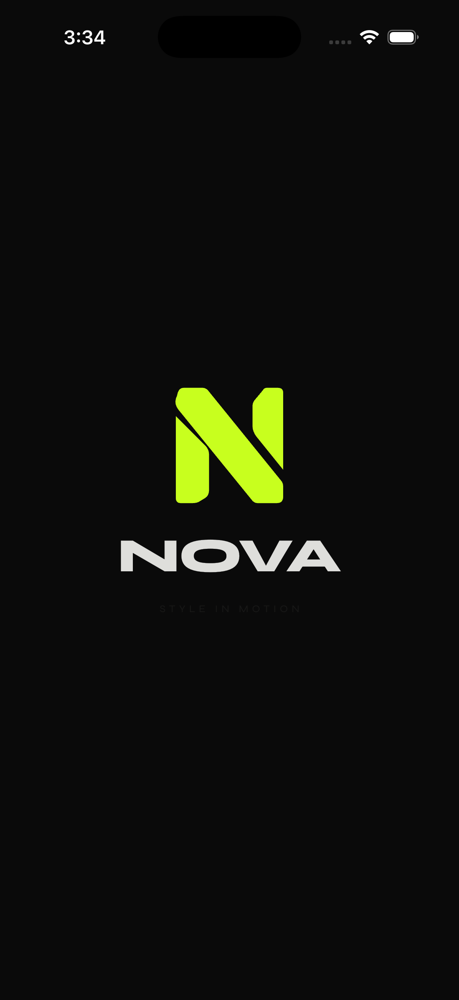
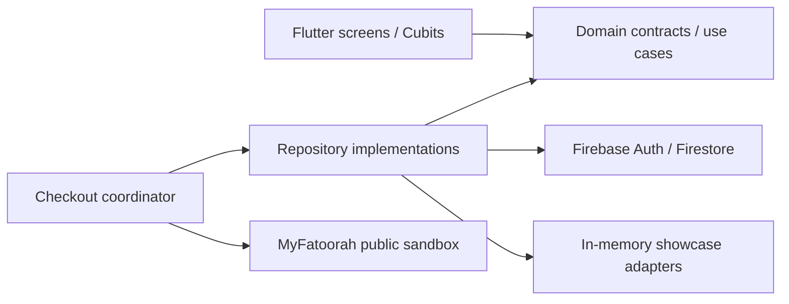

<div align="center">
  
  <h1>NOVA — Style in motion.</h1>
  <p><strong>An editorial fashion experience, built in Flutter.</strong></p>
  <p>Distinctive identity. Connected shopping flows. Firebase-backed accounts. Sandbox checkout.</p>
  <p>
    <a href="https://husseinabozina.github.io/fashion_e_commerce/"><strong>Explore the portfolio ↗</strong></a> &nbsp; · &nbsp;
    <a href="https://husseinabozina.github.io/fashion_e_commerce/#film"><strong>Watch the app ↗</strong></a> &nbsp; · &nbsp;
    <a href="#run-locally"><strong>Run locally ↓</strong></a>
  </p>
  <p>
    <a href="https://github.com/Husseinabozina/fashion_e_commerce/actions/workflows/flutter_quality.yml"></a>
    
    
    
  </p>
</div>

<a href="https://husseinabozina.github.io/fashion_e_commerce/">
  
</a>

NOVA connects the visual energy of a streetwear editorial with the practical details of mobile shopping: finding a product, choosing a size, saving a piece, managing a bag and completing a demo order. Its custom **Fold N** identity carries through the app icon, native splash and animated Flutter launch.

This is a **portfolio application** with sample products and virtual transactions. It is not an operating retailer, and it does not collect real payments or fulfill orders.

## See the experience

These are captures from the running iPhone simulator app, supplied by the project owner on October 5, 2026.

<table>
  <tr>
    <td align="center" width="33%"><br/><strong>Discover the drop</strong><br/><sub>Editorial home and product discovery</sub></td>
    <td align="center" width="33%"><br/><strong>Find your rotation</strong><br/><sub>A contrasting editorial experience</sub></td>
    <td align="center" width="33%"><br/><strong>Make it yours</strong><br/><sub>Variants, bag management and promotions</sub></td>
  </tr>
  <tr>
    <td align="center"><br/><strong>A personal space</strong><br/><sub>Guest browsing and account features</sub></td>
    <td align="center"><br/><strong>Close the loop</strong><br/><sub>A clear demo order receipt</sub></td>
    <td align="center"><br/><strong>One consistent identity</strong><br/><sub>From the launcher to the storefront</sub></td>
  </tr>
</table>

**[Watch the 50-second app film](https://husseinabozina.github.io/fashion_e_commerce/#film)** — launch, browsing, product details and selection, recorded in the actual Flutter app. The public cut excludes the address-entry section. **[Explore full-size screens](https://husseinabozina.github.io/fashion_e_commerce/#experience)** in the interactive gallery.

## Product capabilities

| Journey             | Implemented experience                                                                                      |
| ------------------- | ----------------------------------------------------------------------------------------------------------- |
| Discover            | Editorial home, categories, search, product details, sizes/colors and complete-the-look suggestions         |
| Save                | Wishlist, followed brands, recently viewed items and shopping preferences                                   |
| Build a bag         | Variant selection, quantities, removal, promotion codes and EGP totals                                      |
| Check out           | Address → delivery → payment → review → demo receipt                                                        |
| Pay in a sandbox    | MyFatoorah hosted test checkout, result verification, pending/retry handling and duplicate-order protection |
| Keep an account     | Anonymous guest sessions, email/password registration and login, password reset and account-scoped data     |
| Localize            | English and Arabic interfaces, including RTL layouts                                                        |
| Recognize the brand | Shared vector identity, native icons/splash and a finite launch animation with reduced-motion support       |

For clients, the project demonstrates a connected shopping experience that can be explored and reviewed. For engineering teams, its repositories, adapters and tests make the implementation decisions inspectable.

## Engineering worth inspecting



Feature-first Clean Architecture keeps UI state separate from networking and storage. The composition layer selects concrete adapters; domain layers are used where business rules need them.

| Decision                      | Why it matters                                                                  | Evidence                                                                                        |
| ----------------------------- | ------------------------------------------------------------------------------- | ----------------------------------------------------------------------------------------------- |
| Guest-to-account linking      | Creating an account can preserve the guest UID and shopping data                | [Authentication adapter](lib/features/auth/data/datasources/firebase_auth_data_source.dart)     |
| Account-scoped state          | Signing into another account must not retain someone else's bag or late results | [Firebase adapter tests](test/firebase_data_test.dart)                                          |
| Idempotent checkout           | Retrying a save must not create a second demo receipt                           | [Checkout flow tests](test/checkout_sandbox_flow_test.dart)                                     |
| Explicit payment verification | A browser return alone does not prove a successful payment                      | [Sandbox integration](docs/sandbox-payments.md)                                                 |
| Enforced data ownership       | Clients cannot alter catalog prices or another user's private documents         | [Firestore rules](firestore.rules) · [Emulator tooling](tools/firebase)                         |
| Consistent launch geometry    | The same N shape drives the vector exports and Flutter rendering                | [Brand source and motion](docs/branding/README.md) · [Launch tests](test/nova_launch_test.dart) |

**Quality checks:** [GitHub Actions](https://github.com/Husseinabozina/fashion_e_commerce/actions/workflows/flutter_quality.yml) runs Flutter analysis/tests, Firebase rules/auth emulator verification and notification-function tests. Provider smoke tests are opt-in so ordinary CI does not create payment invoices. See the workflow and test sources for current results rather than a frozen test-count badge.

## The identity

**NOVA Fold** uses three vector pieces and a diagonal seam to suggest folded fabric and forward movement. Acid lime creates a clear action color against near-black and off-white; the bundled Syne display face gives the wordmark and headlines their wide editorial character.

| Ink       | Acid lime | Off-white | Motion                                               |
| --------- | --------- | --------- | ---------------------------------------------------- |
| `#0A0A0A` | `#C8FF1E` | `#F5F5F2` | Finite 1.6-second reveal; reduced-motion alternative |

[Identity sources, design provenance and export process](docs/branding/README.md) · [Animated preview from the actual Flutter widget](site/assets/brand/launch.gif)

## Demo scope, clearly stated

- **Payments:** the public MyFatoorah sandbox creates a fixed **virtual 1 KWD** invoice, separate from the sample EGP bag total. No real charge. NOVA verifies invoice identity, reference, amount and status before saving a demo receipt. Confirmation requires the app to be open; there is no background payment webhook.
- **Data:** Firebase-backed accounts and shopping state are implemented. An in-memory mode is available for UI exploration. Sample product names, images and prices are illustrative, not verified inventory or brand partnerships.
- **Notifications:** push registration, handling and notification functions are implemented; automated delivery is **not deployed**. Device push requires additional service configuration.
- **Operations:** real inventory, shipping, live payments and operational refunds are outside this showcase. Order receipts and delivery estimates are demo content.

The [payment guide](docs/sandbox-payments.md) explains test cards, retry behavior and provider limitations. Private merchant credentials never belong in a mobile app or a public repository.

## Run locally

Use **Flutter 3.41.9**, the version pinned in CI. Select the same SDK in your editor and terminal. iOS requires macOS/Xcode and an iOS 15+ target; Android requires its SDK and a device/emulator.

```sh
git clone https://github.com/Husseinabozina/fashion_e_commerce.git
cd fashion_e_commerce
flutter pub get

# Explore with in-memory data; no Firebase account setup required.
flutter run --dart-define=USE_DEMO_DATA=true

# Or use the configured Firebase-backed application.
flutter run
```

In-memory state resets with the process. Remote product images and hosted sandbox payments still need connectivity. See [developer setup](docs/development-setup.md) and [iOS simulator troubleshooting](docs/ios-simulator-build.md) for native build details.

```sh
flutter analyze --no-fatal-infos --no-fatal-warnings
flutter test
```

For backend/emulator setup, account behavior and maintenance commands, see [runtime and Firebase notes](docs/runtime-and-firebase.md).

### Android download

[Android sandbox releases](https://github.com/Husseinabozina/fashion_e_commerce/releases) are available for manual exploration. The **October 3, 2026 APK is an earlier snapshot and predates the current branding shown above**. Build from current source for the latest identity:

```sh
flutter build apk --release
```

## Explore the project

| Resource                                                               | What you will find                                        |
| ---------------------------------------------------------------------- | --------------------------------------------------------- |
| [Live portfolio](https://husseinabozina.github.io/fashion_e_commerce/) | Visual case study, interactive screens and app film       |
| [Architecture](docs/architecture/clean_architecture.md)                | Layer boundaries and feature organization                 |
| [Firebase integration](docs/firebase-integration.md)                   | Backend setup and acceptance evidence                     |
| [Sandbox payments](docs/sandbox-payments.md)                           | Provider flow, verification and demo limitations          |
| [Brand system](docs/branding/README.md)                                | Editable geometry, icon exports and launch behavior       |
| [Showcase media](docs/showcase/README.md)                              | Capture provenance, public video cut and site maintenance |

**Hussein Abozina** · [GitHub profile](https://github.com/Husseinabozina) · [Brees](https://husseinabozina.github.io/Brees-Mobile-App/) · [HealthTrack](https://husseinabozina.github.io/medical_app/)

Product photographs and third-party marks appear as illustrative catalog content; no affiliation is implied. Syne is distributed under the [SIL Open Font License](assets/fonts/Syne-OFL.txt).
